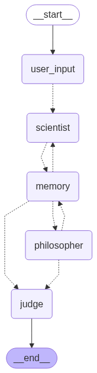

# Multi-Agent Debate DAG using LangGraph
A debate simulation system using LangGraph where two AI agents (Scientist and Philosopher) engage in structured arguments using `gemini-2.0-flash` model through LangGraph workflow.

## Features

- **Structured 8-round debate** between two specialized AI personas
- **Memory management** with argument summarization and context preservation
- **Automated judging** with logical evaluation and winner declaration
- **Complete logging** of all interactions, state transitions, and decisions
- **CLI interface** for easy interaction
- **DAG visualization** of the workflow structure

## Installing uv

If you don't have `uv` installed, install it first:
```bash
# On macOS and Linux
curl -LsSf https://astral.sh/uv/install.sh | sh

# On Windows
powershell -c "irm https://astral.sh/uv/install.ps1 | iex"

# Alternative: Install via pip
pipx install uv
```
### Setup

1. **Clone the repository**
```bash
git clone https://github.com/aashu-0/multiagent_debate_dag.git
cd multiagent_debate_dag
```

2. **Create virtual environment**
```bash
uv venv
# activate
source .venv/bin/activate
```

3. **Install project dependencies:**
```bash
uv sync
```

4. **Set up Google API Key:**
- Get a Google API key from [Google AI Studio](https://aistudio.google.com/app/apikey)
- Either set it as an environment variable:
 ```bash
 export GOOGLE_API_KEY="your_api_key_here"
 ```
- Or the program will prompt you to enter it when running

## Usage

### Running the Project

```bash
python main.py
```

The system will prompt you for:
1. Google API key (if not set as environment variable)
2. Debate topic of your choice

### Example Session

## Architecture

### Node Structure

The LangGraph workflow consists of these key nodes:

1. **UserInputNode**: Accepts debate topic and initializes the state
2. **ScientistAgent**: Evidence-based arguments focusing on data and research
3. **PhilosopherAgent**: Conceptual arguments emphasizing ethics and society
4. **MemoryNode**: Updates debate summary and maintains context
5. **JudgeNode**: Evaluates arguments and declares winner

### Workflow Flow



```bash
start → user_input → scientist → memory → philosopher → memory → scientist → memory → ... → judge → end
```
The workflow alternates between agents for exactly 8 rounds, with memory updates after each argument, ending with automated judgment.

## Output Files

The system generates several log files:

1. **`debate_log.txt`**: Real-time logging of all system operations
2. **`complete_debate_log.json`**: Structured JSON log with full debate data
3. **`debate_workflow_diagram.png`**: Visual representation of the workflow


## Customization

### Changing Agent Personas
Modify the prompt templates in `scientist_agent_node()` and `philosopher_agent_node()` to create different agent types (e.g., Economist vs Environmentalist).

### Adjusting Debate Length
Change the round limit in the conditional logic within agent nodes and the `should_continue_debate()` function.

### Model Configuration
Adjust the Gemini model parameters in the `__init__` method:
```python
self.llm = ChatGoogleGenerativeAI(
    model="gemini-2.0-flash",
    temperature=0.7,     # adjust creativity (0.0-1.0)
    max_tokens=1000      # limit response length
)
```
## Example Session
```text
🔄 Workflow DAG Diagram saved as 'debate_workflow_diagram.png'
==================================================


Enter topic for debate: Should AI be regulated like medicine?

============================================================
🎭 DEBATE: Scientist vs Philosopher
📋 Topic: Should AI be regulated like medicine?
============================================================

🔬[Round 1] Scientist:
    Regulating AI like medicine is crucial due to the potential for demonstrable harm, mirroring the risks associated with pharmaceuticals. Just as clinical trials and post-market surveillance are essential for ensuring drug safety, similar rigorous testing and monitoring frameworks are needed for AI systems to mitigate biases, prevent unintended consequences, and safeguard public well-being based on empirical risk assessment. This approach allows for iterative improvements and data-driven adjustments, ensuring AI's benefits outweigh its potential harms, as evidenced by the success of medical regulations in safeguarding public health.

🤔 [Round 2] Philosopher:
   While the potential for harm from AI warrants serious consideration, regulating it precisely like medicine risks stifling innovation and individual freedom, violating the principle of proportionality; medicine addresses tangible, physical harms, whereas AI's potential harms are often abstract, societal, and require a more nuanced ethical framework that balances potential risks with the long-term benefits of technological progress and the preservation of individual autonomy in a rapidly evolving digital landscape. The history of technological regulation demonstrates that overly restrictive measures can hinder progress, and a purely medical model fails to account for the unique socio-cultural impact of AI, potentially leading to unintended consequences that outweigh the intended benefits.
... [continues for 8 rounds]

============================================================

[Judge] Summary of debate:
============================================================
The debate centered on balancing AI safety through regulation versus preserving innovation freedom. The Scientist emphasized empirical risks and safety protocols, while the Philosopher focused on innovation potential and regulatory overreach concerns.

[Judge] Winner: Scientist
Reason: Presented more concrete evidence of AI risks and drew compelling parallels to established regulatory frameworks, while effectively countering philosophical concerns with practical safety considerations.
============================================================

==================================================
DEBATE COMPLETE!
==================================================
Winner: Scientist
Check 'debate_log.txt' and 'complete_debate_log.json' for full logs.
```